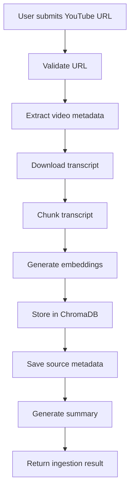
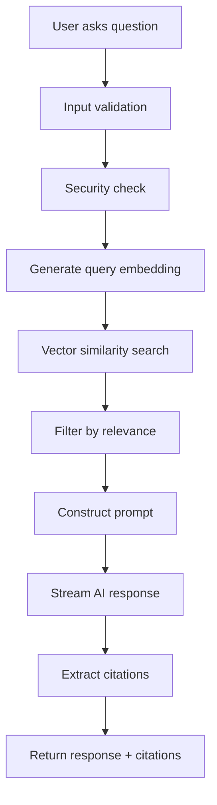
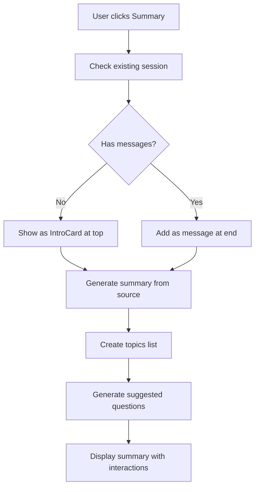

# TubeQuery Architecture Documentation

## Overview

TubeQuery is a sophisticated YouTube RAG (Retrieval-Augmented Generation) system that allows users to ingest YouTube videos, process their transcripts, and ask intelligent questions with timestamped citations. The system combines modern web technologies with AI/ML capabilities to create a seamless video analysis experience.

## System Architecture

```
┌─────────────────┐    ┌─────────────────┐    ┌─────────────────┐
│   Frontend      │    │   Backend API   │    │   AI Services   │
│   (Next.js)     │◄──►│   (FastAPI)     │◄──►│   (Gemini)      │
└─────────────────┘    └─────────────────┘    └─────────────────┘
         │                       │                       │
         │                       │                       │
         ▼                       ▼                       ▼
┌─────────────────┐    ┌─────────────────┐    ┌─────────────────┐
│   Supabase      │    │   ChromaDB      │    │   YouTube API   │
│   (Auth/DB)     │    │   (Vector DB)   │    │   (Transcripts) │
└─────────────────┘    └─────────────────┘    └─────────────────┘
```

## Technology Stack

### Frontend (tubequery-ui/)
- **Framework**: Next.js 14 with App Router
- **Language**: TypeScript
- **Styling**: Custom CSS with CSS Variables
- **Fonts**: Manrope (headlines), Inter (body), DM Mono (code)
- **State Management**: React hooks and context
- **Authentication**: Supabase Auth with Firebase integration

### Backend (tubequery/)
- **Framework**: FastAPI (Python)
- **Language**: Python 3.11+
- **Database**: Supabase (PostgreSQL)
- **Vector Database**: ChromaDB
- **AI/ML**: Google Gemini API
- **Authentication**: Supabase JWT validation
- **Security**: Custom prompt injection protection

### External Services
- **Authentication**: Supabase Auth
- **Database**: Supabase PostgreSQL
- **AI Model**: Google Gemini Pro/Flash
- **Video Processing**: YouTube Data API v3
- **Transcript Extraction**: youtube-transcript-api
- **Caching & Rate Limiting**: Upstash Redis

## YouTube Integration Details

### API Dependencies
1. **YouTube Data API v3**: Required for playlist enumeration and video metadata
2. **YouTube oEmbed API**: Used for video titles (no auth required)
3. **youtube-transcript-api**: For transcript extraction

### Cookie Usage (Optional)
- `youtube_cookies.txt` is used only for transcript fetching
- **Production Impact**: System works without cookies, but may experience:
  - Occasional transcript failures for restricted videos
  - IP-based rate limiting for high-volume usage
- **Recommendation**: Deploy without cookies initially, add if needed

### Production Deployment Notes
- YouTube API key is essential for playlist support
- Cookies file is optional but can improve transcript success rate
- All API calls include proper error handling and fallbacks

## Detailed Component Architecture

### 1. Frontend Architecture

#### Component Hierarchy
```
App (layout.tsx)
├── AuthProvider (context/AuthContext.tsx)
├── Home Page (app/page.tsx)
│   ├── Sidebar (components/Sidebar.tsx)
│   │   ├── Library Management
│   │   ├── Chat History
│   │   └── User Profile
│   ├── ChatPanel (components/ChatPanel.tsx)
│   │   ├── MessageBubble (components/MessageBubble.tsx)
│   │   ├── IntroCard (components/IntroCard.tsx)
│   │   └── Input Interface
│   └── IngestionPanel (components/IngestionPanel.tsx)
│       ├── URL Input
│       ├── Source Management
│       └── Summary Generation
├── Login Page (app/login/page.tsx)
└── Profile Page (app/profile/page.tsx)
```

#### Key Frontend Features
- **Responsive Design**: Desktop-first with mobile adaptations
- **Real-time Streaming**: Server-Sent Events for chat responses
- **State Management**: Session persistence with Supabase
- **Security**: Input validation and XSS protection
- **Performance**: Component memoization and lazy loading

### 2. Backend Architecture

#### API Structure
```
api/
├── main.py                 # FastAPI app initialization
├── auth.py                 # Authentication middleware
├── db.py                   # Database operations
├── dependencies.py         # Dependency injection
├── schemas.py              # Pydantic models
└── routers/
    ├── chat.py            # Chat endpoints
    ├── ingest.py          # Video ingestion
    ├── sources.py         # Source management
    ├── sessions.py        # Chat sessions
    ├── profile.py         # User profiles
    └── kbs.py             # Knowledge bases
```

#### Core Services
```
services/
├── llm_service.py         # AI model integration
├── embedding_service.py   # Text embeddings
└── vector_store.py        # ChromaDB operations

core/
├── ingestion.py           # Video processing pipeline
├── retriever.py           # RAG implementation
├── chunker.py             # Text chunking
├── youtube.py             # YouTube API integration
└── source_store.py        # Source metadata

models/
├── answer.py              # Response models
├── chunk.py               # Text chunk models
└── source.py              # Source models
```

#### Security Layer
```
middleware/
└── rate_limit.py          # Rate limiting

utils/
└── security.py            # Prompt injection protection
```

## Data Flow & Workflows

### 1. Video Ingestion Workflow



**Detailed Steps:**

1. **URL Validation**: Check if URL is valid YouTube video/playlist/channel
2. **Metadata Extraction**: Use YouTube API to get title, duration, description
3. **Transcript Download**: 
   - Try YouTube's auto-generated captions first
   - Fallback to yt-dlp + Whisper if needed
4. **Text Chunking**: Split transcript into semantic chunks (~500 tokens)
5. **Embedding Generation**: Create vector embeddings using Gemini
6. **Vector Storage**: Store embeddings in ChromaDB with metadata
7. **Source Metadata**: Save source info in Supabase
8. **Summary Generation**: Create AI-generated summary with topics and questions

### 2. Chat Query Workflow



**Detailed Steps:**

1. **Input Validation**: Check length, format, and injection patterns
2. **Security Check**: Rate limiting and prompt injection detection
3. **Query Embedding**: Convert question to vector using same model
4. **Similarity Search**: Find most relevant chunks in ChromaDB
5. **Relevance Filtering**: Remove chunks below similarity threshold
6. **Prompt Construction**: Build context with retrieved chunks
7. **AI Generation**: Stream response from Gemini with citations
8. **Citation Extraction**: Parse timestamps and create clickable links
9. **Response Delivery**: Stream tokens to frontend via SSE

### 3. Summary Generation Workflow



## Database Schema

### Supabase Tables

#### users
```sql
CREATE TABLE users (
    id UUID PRIMARY KEY DEFAULT gen_random_uuid(),
    email TEXT UNIQUE NOT NULL,
    display_name TEXT,
    created_at TIMESTAMP DEFAULT NOW(),
    updated_at TIMESTAMP DEFAULT NOW()
);
```

#### knowledge_bases
```sql
CREATE TABLE knowledge_bases (
    id UUID PRIMARY KEY DEFAULT gen_random_uuid(),
    name TEXT NOT NULL,
    user_id UUID REFERENCES users(id),
    created_at TIMESTAMP DEFAULT NOW(),
    UNIQUE(name, user_id)
);
```

#### sources
```sql
CREATE TABLE sources (
    id UUID PRIMARY KEY DEFAULT gen_random_uuid(),
    title TEXT NOT NULL,
    url TEXT NOT NULL,
    source_type TEXT NOT NULL,
    kb_id UUID REFERENCES knowledge_bases(id),
    status TEXT DEFAULT 'processing',
    video_count INTEGER DEFAULT 0,
    chunk_count INTEGER DEFAULT 0,
    metadata JSONB,
    created_at TIMESTAMP DEFAULT NOW()
);
```

#### chat_sessions
```sql
CREATE TABLE chat_sessions (
    id UUID PRIMARY KEY DEFAULT gen_random_uuid(),
    user_id UUID REFERENCES users(id),
    source_id UUID REFERENCES sources(id),
    source_title TEXT NOT NULL,
    kb_name TEXT NOT NULL,
    messages JSONB DEFAULT '[]',
    created_at TIMESTAMP DEFAULT NOW(),
    updated_at TIMESTAMP DEFAULT NOW()
);
```

#### usage_logs
```sql
CREATE TABLE usage_logs (
    id UUID PRIMARY KEY DEFAULT gen_random_uuid(),
    user_id UUID REFERENCES users(id),
    action TEXT NOT NULL,
    metadata JSONB,
    created_at TIMESTAMP DEFAULT NOW()
);
```

### ChromaDB Collections

#### Document Structure
```python
{
    "id": "chunk_uuid",
    "document": "transcript_text",
    "metadata": {
        "source_id": "source_uuid",
        "video_id": "youtube_video_id",
        "video_title": "Video Title",
        "start_time": 120.5,
        "end_time": 180.0,
        "timestamp_label": "02:00",
        "kb_id": "knowledge_base_id"
    },
    "embedding": [0.1, 0.2, ...] # 768-dimensional vector
}
```

## Security Architecture

### 1. Authentication & Authorization
- **JWT Tokens**: Supabase-issued tokens for API access
- **Row Level Security**: Database-level access control
- **Session Management**: Secure session handling with refresh tokens

### 2. Input Validation
- **Schema Validation**: Pydantic models for request validation
- **Length Limits**: Maximum input sizes to prevent abuse
- **Format Validation**: URL, email, and identifier format checks

### 3. Prompt Injection Protection
- **Pattern Detection**: Regex-based injection attempt detection
- **System Prompt Hardening**: Explicit security instructions
- **Input Sanitization**: Cleaning and normalizing user input
- **Response Filtering**: Removing sensitive information from outputs

### 4. Rate Limiting
- **Per-User Limits**: 60 requests per minute per user
- **Sliding Window**: Time-based request tracking
- **Endpoint-Specific**: Different limits for different operations

### 5. Security Headers
```python
SECURITY_HEADERS = {
    "X-Content-Type-Options": "nosniff",
    "X-Frame-Options": "DENY", 
    "X-XSS-Protection": "1; mode=block",
    "Referrer-Policy": "strict-origin-when-cross-origin",
    "Content-Security-Policy": "default-src 'self'"
}
```

## Performance Optimizations

### 1. Frontend Optimizations
- **Component Memoization**: React.memo for expensive components
- **Lazy Loading**: Dynamic imports for non-critical components
- **Image Optimization**: Next.js automatic image optimization
- **Bundle Splitting**: Automatic code splitting by Next.js

### 2. Backend Optimizations
- **Connection Pooling**: Database connection reuse
- **Async Operations**: Non-blocking I/O for all operations
- **Streaming Responses**: Real-time response delivery
- **Caching**: TTL-based caching for expensive operations

### 3. Database Optimizations
- **Indexing**: Proper indexes on frequently queried columns
- **Vector Search**: Optimized similarity search in ChromaDB
- **Query Optimization**: Efficient SQL queries with proper joins

## Deployment Architecture

### Development Environment
```
Frontend: localhost:3000 (Next.js dev server)
Backend: localhost:8000 (uvicorn dev server)
Database: Supabase cloud instance
Vector DB: Local ChromaDB instance
```

### Production Environment
```
Frontend: Vercel/Netlify (Static deployment)
Backend: Railway/Fly.io (Container deployment)
Database: Supabase (Managed PostgreSQL)
Vector DB: Persistent ChromaDB volume
```

## Configuration Management

### Environment Variables

#### Frontend (.env.local)
```bash
NEXT_PUBLIC_SUPABASE_URL=your_supabase_url
NEXT_PUBLIC_SUPABASE_ANON_KEY=your_anon_key
NEXT_PUBLIC_API_BASE_URL=http://localhost:8000
```

#### Backend (.env)
```bash
SUPABASE_URL=your_supabase_url
SUPABASE_SERVICE_KEY=your_service_key
GEMINI_API_KEY=your_gemini_key
YOUTUBE_API_KEY=your_youtube_key
CHROMA_DIR=./data/chromadb
DATA_DIR=./data
```

## Error Handling & Logging

### Frontend Error Handling
- **Error Boundaries**: React error boundaries for component errors
- **API Error Handling**: Centralized error handling in API client
- **User Feedback**: Toast notifications and error states

### Backend Error Handling
- **Exception Middleware**: Global exception handling
- **Structured Logging**: JSON-formatted logs with context
- **Error Responses**: Consistent error response format

### Monitoring & Observability
- **Request Logging**: All API requests logged with timing
- **Error Tracking**: Exception tracking with stack traces
- **Performance Metrics**: Response times and resource usage

## API Documentation

### Core Endpoints

#### Authentication
- `POST /auth/login` - User login
- `POST /auth/logout` - User logout
- `GET /auth/user` - Get current user

#### Ingestion
- `POST /ingest` - Ingest YouTube content
- `GET /ingest/status/{source_id}` - Check ingestion status

#### Chat
- `POST /chat` - Ask question (synchronous)
- `POST /chat/stream` - Ask question (streaming)

#### Sources
- `GET /sources` - List all sources
- `DELETE /sources/{source_id}` - Delete source
- `GET /sources/{source_id}/intro` - Get source summary

#### Sessions
- `GET /sessions` - List chat sessions
- `POST /sessions` - Create new session
- `PUT /sessions/{session_id}` - Update session
- `DELETE /sessions/{session_id}` - Delete session

#### Knowledge Bases
- `GET /kbs` - List knowledge bases
- `POST /kbs` - Create knowledge base
- `DELETE /kbs/{kb_id}` - Delete knowledge base

## Future Enhancements

### Planned Features
1. **Multi-modal Support**: Image and audio analysis
2. **Collaborative Features**: Shared knowledge bases
3. **Advanced Analytics**: Usage insights and trends
4. **API Integrations**: Third-party service connections
5. **Mobile App**: React Native mobile application

### Scalability Improvements
1. **Microservices**: Split into smaller services
2. **Message Queues**: Async processing with Redis/RabbitMQ
3. **CDN Integration**: Global content delivery
4. **Auto-scaling**: Dynamic resource allocation
5. **Load Balancing**: Multi-instance deployment

## Development Guidelines

### Code Standards
- **TypeScript**: Strict type checking enabled
- **ESLint**: Consistent code formatting
- **Prettier**: Automatic code formatting
- **Conventional Commits**: Standardized commit messages

### Testing Strategy
- **Unit Tests**: Component and function testing
- **Integration Tests**: API endpoint testing
- **E2E Tests**: Full workflow testing
- **Performance Tests**: Load and stress testing

### Git Workflow
- **Feature Branches**: Separate branches for features
- **Pull Requests**: Code review process
- **Automated Testing**: CI/CD pipeline integration
- **Semantic Versioning**: Version management

This architecture provides a robust, scalable, and secure foundation for the TubeQuery application, enabling efficient video analysis and intelligent question-answering capabilities.